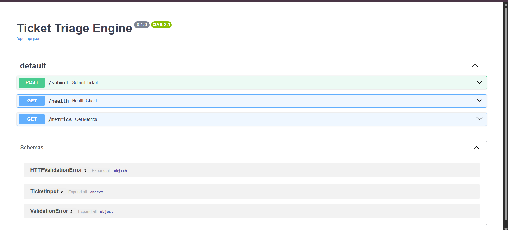
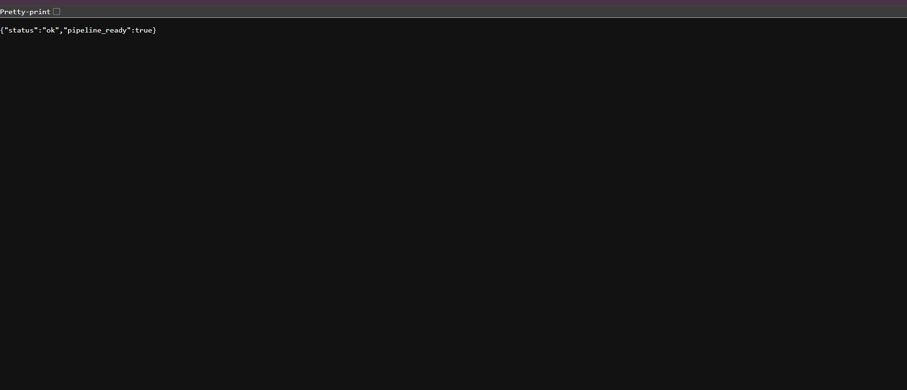
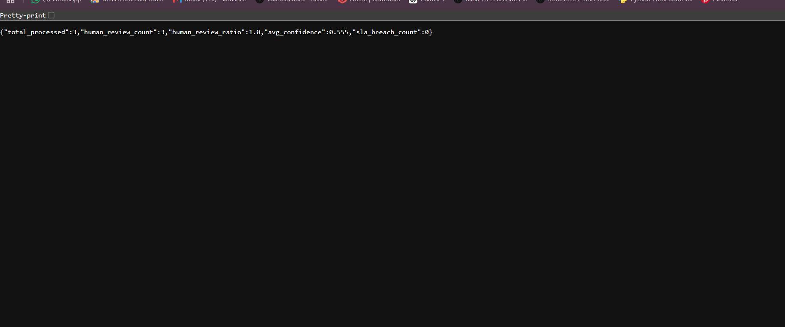

# AI Ticket Triage Engine


An end-to-end machine learning-powered backend that automatically classifies, prioritizes, routes, and stores customer support tickets through a production-style REST API.

The project demonstrates modern backend engineering practices including machine learning integration, object-oriented programming, REST API development, SQLAlchemy ORM, Docker containerization, automated testing, static type checking, and cloud deployment.

---

# Live Demo

- **Swagger Documentation:** https://ticket-triage-9140.onrender.com/docs
- **Health Endpoint:** https://ticket-triage-9140.onrender.com/health
- **Metrics Endpoint:** https://ticket-triage-9140.onrender.com/metrics

---

## Screenshots

### Swagger UI



### Health Endpoint



### Metrics Endpoint



---

## Features

- Automatic ticket classification using Scikit-learn
- Confidence-aware routing using prediction confidence
- Human review queue for uncertain predictions
- SQLite persistence using SQLAlchemy ORM
- Metrics endpoint for processed tickets
- FastAPI REST API
- Interactive Swagger/OpenAPI documentation
- Dockerized deployment
- Cloud deployment using Render
- Unit testing with Pytest
- Static type checking with MyPy
- Code formatting with Ruff

---

## Design Patterns Used

- Strategy Pattern
- Observer Pattern
- Dependency Injection
- Modular Pipeline Architecture

---

## Architecture

```text
                 Client
                    │
                    ▼
              FastAPI REST API
                    │
                    ▼
             Ticket Validation
                    │
                    ▼
        Scikit-Learn Classifier
                    │
                    ▼
      Confidence Threshold Policy
             │               │
             ▼               ▼
      Support Team      Human Review
             │
             ▼
     SQLAlchemy + SQLite
             │
             ▼
      Metrics & Analytics
```

---

## Tech Stack

| Category | Technology |
|----------|------------|
| Language | Python 3.13 |
| API Framework | FastAPI |
| Machine Learning | Scikit-learn |
| Data Processing | Pandas |
| Validation | Pydantic |
| Database | SQLite |
| ORM | SQLAlchemy |
| Logging | Loguru |
| Testing | Pytest |
| Static Analysis | MyPy |
| Formatting | Ruff |
| Containerization | Docker |
| Deployment | Render |

---

## Project Structure

```text
ticket-triage/
│
├── api/
├── classifiers/
├── db/
├── data/
├── images/
├── models/
├── observers/
├── pipelines/
├── policies/
├── routers/
├── tests/
│
├── Dockerfile
├── .dockerignore
├── pyproject.toml
├── README.md
├── run_classifier.py
├── run_phase2.py
└── run_pipeline.py
```

---

## API Endpoints

| Method | Endpoint | Description |
|---------|----------|-------------|
| POST | `/submit` | Submit a support ticket for classification |
| GET | `/health` | Check API health |
| GET | `/metrics` | View ticket processing metrics |

---

## Example Request

```json
{
  "title": "Payment failed",
  "description": "Card declined during subscription upgrade."
}
```

---

## Example Response

```json
{
  "ticket_id": "f4a4b1...",
  "category": "Account",
  "urgency": "High",
  "confidence": 0.82,
  "assigned_to": "account-team"
}
```

---

## Running Locally

Clone the repository

```bash
git clone https://github.com/khushiiiguptaa06-hub/ticket-triage.git
cd ticket-triage
```

Create a virtual environment

```bash
python -m venv .venv
```

Activate it

### Windows

```bash
.venv\Scripts\activate
```

### Linux / macOS

```bash
source .venv/bin/activate
```

Install dependencies

```bash
pip install -e .
```

Run the API

```bash
uvicorn api.main:app --reload
```

Open:

```
http://127.0.0.1:8000/docs
```

---

## Running with Docker

Build the Docker image

```bash
docker build -t ticket-triage .
```

Run the container

```bash
docker run -p 8000:8000 ticket-triage
```

Open:

```
http://localhost:8000/docs
```

---

## Running Tests

```bash
pytest
```

---

## Code Quality

Format the project

```bash
ruff format .
```

Run static type checking

```bash
python -m mypy .
```

---

## Future Improvements

- JWT Authentication
- PostgreSQL support
- Redis caching
- Background task processing with Celery
- GitHub Actions CI/CD
- Kubernetes deployment
- Model retraining pipeline
- Analytics dashboard

---

## Author

**Khushi Gupta**

B.Tech Computer Science Engineering

Aspiring AI/ML & Backend Developer

GitHub: https://github.com/khushiiiguptaa06-hub

---

## License

This project is intended for educational and portfolio purposes.